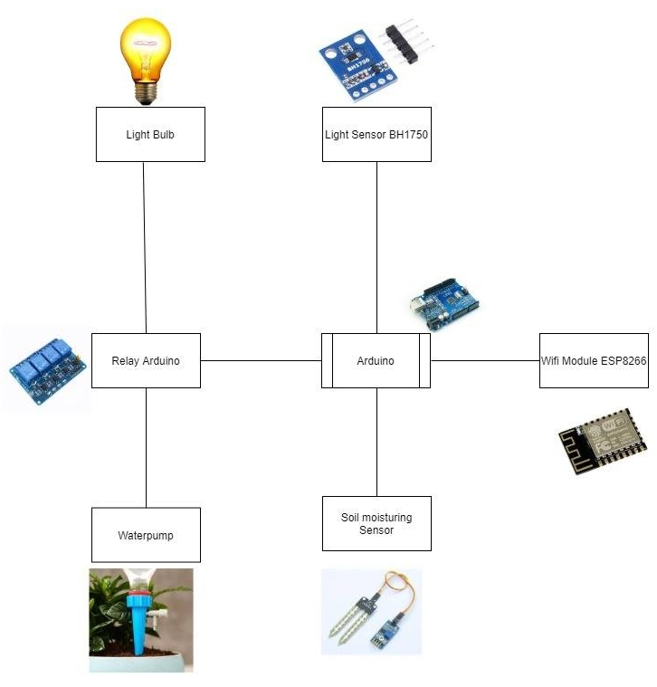
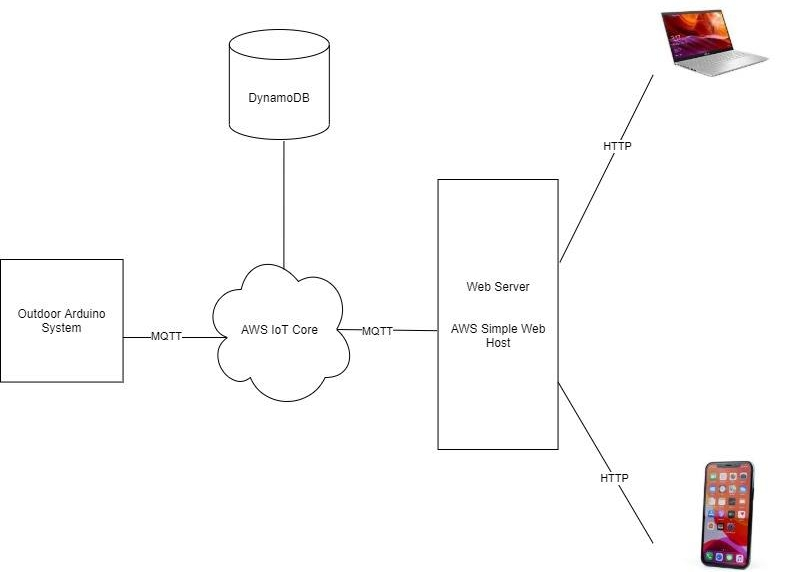

# Automatic Watering and Lighting System for Potted Plant

---

# Features

+ Automatically maintain optimal water and light condition
+ Remotely monitor soil moisture and ambient light level
+ Remotely control lightbuilb and pump
+ Alexa integration

---

# System design

---

# System design

---

# Latest works

+ Connect the Arduino to AWS broker
+ Connect DynamoDB with AWS broker to persist system's data

---

# Schuled works

+ Web interface for user's interaction with the Arduino
+ Integrate Alexa into the system
+ Find suitable methods for automatic irrigation and light control

---

# Roadblocks

Finding analysis methods for home potted plants